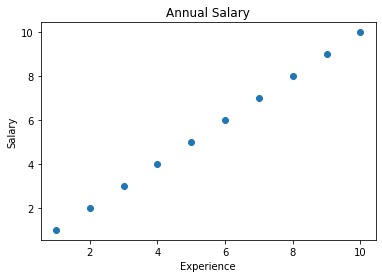
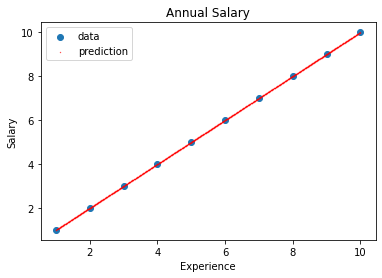

# DeepLearning Pytorch linear function tutorial
Hellow everyone this is "CodingOpera" and my name is "Master.M". Nice to meet you guys. Today I will show you how to use linear function DeepLearning frame work in pytorch. The subject is the correlation between salary and career.  

```python
import torch
import torch.nn as nn

import matplotlib.pyplot as plt

from tqdm import tqdm
```
First of all, we have to import some class packages. Before this work, you should download class packages using by "pip"method (e.g. "pip install torch"). If you want to more about this, please refer to this site (https://pypi.org/project/torch/). 


```python
x = [1, 2, 3, 4, 5, 6, 7, 8, 9, 10]
y = [1, 2, 3, 4, 5, 6, 7, 8, 9, 10]

x = torch.tensor(x).unsqueeze(dim=1).float()
y = torch.tensor(y).unsqueeze(dim=1).float()
```
For this tutorial, we need some data. The "x"dataset is meaning of "career" and "y"dataset is a "salary". And we have to make "tensor" type of data. The "tensor"is a type of data, like box. The AI engine (pytorch, tensorflow etc) need to this "tensor" type data, for the training. So we change the data type, using by "torch.tensor()".  


```python
plt.title('Annual Salary')
plt.xlabel('Experience')
plt.ylabel('Salary')
plt.scatter(x, y)
plt.show()
```


    


This graph is showing our data set. When career is 1, the salary is also 1. And we already know the salary when career is 1, 2, 3 ... But what if the career is 2.5? In this case we don't know about actual salary, because we don't have this case of data. Instate of this, we can try to estimate the salary when career is 2.5. This concept is the powerful reason why we using the AI.


```python
model = nn.Linear(in_features=1, out_features=1, bias=True)
criterion = nn.MSELoss()
optimizer = torch.optim.Adam(params=model.parameters(), lr=0.01)
print(model(x))
```
    tensor([[-0.4567],
            [-0.2023],
            [ 0.0521],
            [ 0.3066],
            [ 0.5610],
            [ 0.8154],
            [ 1.0698],
            [ 1.3242],
            [ 1.5786],
            [ 1.8330]], grad_fn=<AddmmBackward>)
            
The AI module has three main things that are model, loss and optimizer. In this post, I'll explain it briefly now. And detail one is posting later.
- model: It is most important thing as the type of AI. This have many type of model like Linear, RNN, LSTM etc. Most of AI engineers update this part.
- loss: The difference between prediction and real data. Most of AI models are trained to reduce the loss.
- optimizer: The way to reduce a loss. It also has many algorithm like Adam, SGD, Adagrad.


```python
for step in tqdm(range(10000)):
    prediction = model(x)
    loss = criterion(input=prediction, target=y)
    
    optimizer.zero_grad()
    loss.backward()
    optimizer.step()
```
Finally we can train our model. The train process is like this.
    100%|███████████████████████████████████| 10000/10000 [00:02<00:00, 3886.43it/s]
    
- model(input): The prediction value of the model. If you put into the input value, the model output the value. This output value is meaning of a model's prediction value.
- criterion(input=prediction, target=y): It is meaning of the loss. This critertion calculate the difference between prediction and target(real) value.
- optimizer.zero_grad(): Initialize the gradient in optimizer. Because whenever do the backward() process, the gradient is add.
- loss.backward(): Back propagation the loss.
- optimizer.step(): Adjust the parameters by the gradients collected in the backward pass.


```python
test_x = [1+i*0.01 for i in range(900)]
test_x = torch.tensor(test_x).unsqueeze(dim=1).float()
test_y = model(test_x).detach()
```
To test our model's performance, we make the test dataset. The test dataset is the number that is 0.01 intervals from 1 to 10.  Put in the dataset to trained model and get the output dataset. 


```python
plt.title('Annual Salary')
plt.xlabel('Experience')
plt.ylabel('Salary')
plt.scatter(x, y)
plt.scatter(test_x, test_y, s=0.1, c='r')
plt.legend(('data', 'prediction'))
plt.show()
```
    

    
Finally, we get the result graph. The blue spot is a real data and the red spot is a prediction data. As you can see, the  prediction is very well.       

Today we studied Linear function Deep Learning. If you have ant question about this, please reply on this post. Next time I'll post the details about Deep Learning. See you guys! 

